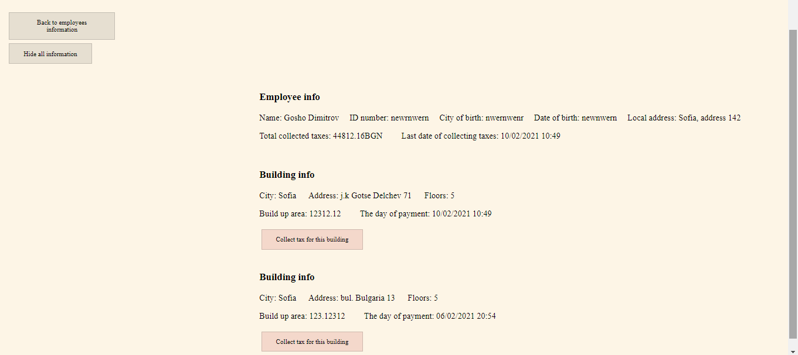

# WebHouseManager
Задача
Да се реализира приложение „Електронен домоуправител“, което да се използва от фирми, които осъществяват професионална дейност по поддръжка на етажна собственост в многофамилни сгради. Във всяка сграда има апаратаменти, разположени на определен етаж, които се характеризират с номер на апартамента, площ, собственик и живущи в тях. Таксите, които се плащат за поддържане на етажната собственост се определят по следния начин: в зависимост от квадратурата на апартамента + допълнителна сума за всеки живущ, който е на възраст над 7 години и използва асансьор. Ако в апартамента има домашен любимец, който използва общите част на сградата, се добавя и определена сума за него. Таксите, които заплащат живущите в сградата се събирата веднъж месечно. Всяка сграда се обслужва от точно един служител на фирмата, с която има сключен договор. При сключване на договор за обслужване на нова сграда, тя се разпределя на служителя с най-малко на брой зачислени сгради. При освобождаване от работа на служител, който има зачислени сгради, неговите сгради се разпределят на останалите служители.
Функционални изисквания на приложението
Приложението Електронен домоуправител трябва да включва минимум следните функционалности:
1. Създаване, редактиране и изтриване на компании с данни за тях
2. Създаване, редактиране и изтриване на сгради с данни за тях (адрес, брой етажи, брой апартаменти, застроена площ, общи части и т.н.)
3. Създаване, редактиране и изтриване на собственици на апартаментите и живущите в тях
4. Създаване, редактиране и изтриване на служители на фирмата
5. Определяне на сградите, които обслужва всеки от служителите на фирмата
6. Въвеждане на такса, която трябва да се плаща от живущите в сграда
7. Плащане на таксите. Въвеждане на платените такси
8. Филтриране и сортиране на данните за:
a. Компаниите: по приход (събрани такси)
b. Служителите на компанията (по име и по брой обслужвани сгради)
c. Живущите в сградите (по име и по възраст)
9. Обобщени и подробни справки (общ брой и списък) за:
a. Обслужвани сгради от всеки служител във дадена фирма
b. Апартаменти в сграда
c. Живущи в сграда
d. Суми за плащане (за всяка компания, за всяка сграда, за всеки служител)
e. Платени суми (за всяка компания, за всяка сграда, за всеки служител)
10. Данните за платените такси трябва да се записват във файл. Информацията, която се записва включва: фирма, служител, сграда, апартамент, сума, дата на плащане.

